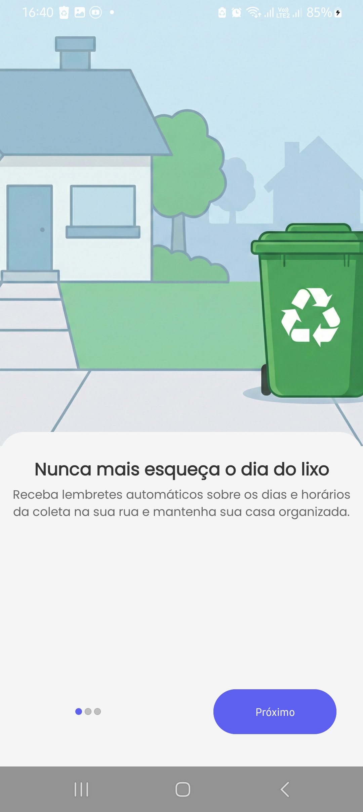
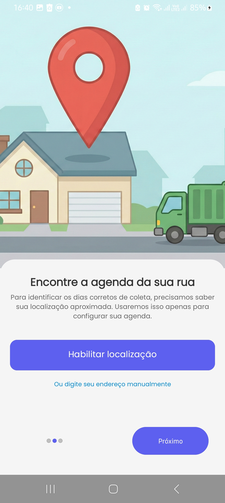
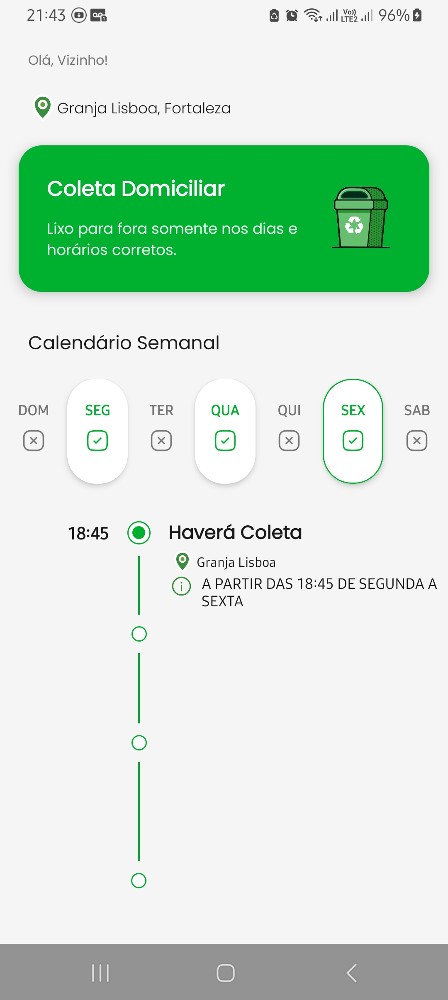
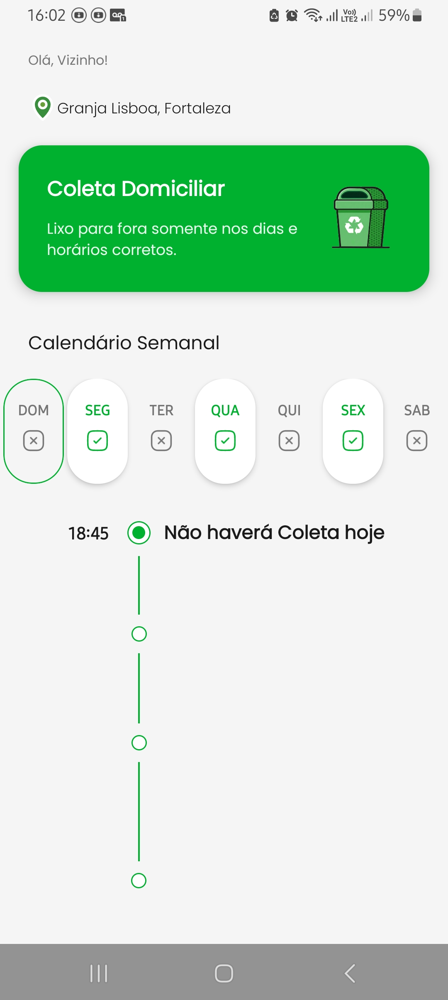
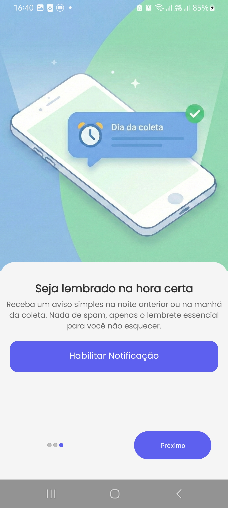

# 📨 ColetaAlert (Alerta Coleta)
O ColetaAlert é um aplicativo nativo Android desenvolvido para solucionar um problema cotidiano: o esquecimento dos dias de coleta de lixo. Ele automatiza o monitoramento do cronograma da Marquise Ambiental e notifica o usuário no momento certo, eliminando a necessidade de inserção manual de horários.

## 🚀 Funcionalidades
Sincronização Automática: O app identifica e coleta os horários de coleta domiciliar diretamente da base de dados da concessionária.
Notificações Inteligentes: Alertas agendados para garantir que você nunca perca o horário do caminhão de lixo.
Foco Regional: Atualmente otimizado para as regiões atendidas pela Marquise Ambiental.
## 🛠 Tecnologias Utilizadas
Este projeto segue as recomendações modernas do Google para o ecossistema Android:

- **Kotlin**: Linguagem oficial e moderna para o desenvolvimento nativo.
- **Retrofit**: Implementação de consumo de API REST para busca automatizada de dados.
    - Acesse a API utilizada aqui: WebScrapingAPIReciclagem
- **WorkManager**: Utilizado para o agendamento de tarefas em segundo plano, garantindo que a notificação seja enviada mesmo se o app estiver fechado.
- **Jetpack DataStore**: Substituindo o SharedPreferences para armazenamento persistente de dados de forma segura e reativa.
- **View & Data Binding**: Utilizados para uma comunicação eficiente entre a lógica do código e os layouts em XML, garantindo maior performance e organização.

## 💼 Permissões Necessárias
Para a experiência completa e funcional, o aplicativo solicita:

- **Internet**: Para consultar os dados da API em tempo real.
- **Notificação**: Essencial para o envio dos lembretes de coleta.
- **Localização**: Utilizada para identificar a rota de coleta correspondente ao endereço do usuário.

# 📸 Screenshots do Aplicativo
<table>
<tr>
<td align="center"><b>Inicialização</b></td>
<td align="center"><b>Localização</b></td>
<td align="center"><b>Dashboard</b></td>
<td align="center"><b>Detalhes</b></td>
<td align="center"><b>Notificação</b></td>
</tr>
<tr>
<td></td>
<td></td>
<td></td>
<td></td>
<td></td>
</tr>
</table>

## 📥 Download

Obtenha a versão mais recente do **ColetaAlert** na nossa página de Releases:

> **Dica:** Na página de download, baixe o arquivo com a extensão `.apk` para instalar diretamente no seu celular.